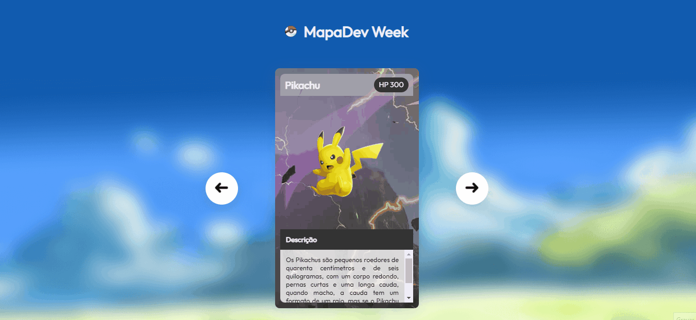

# Projete de slide do pókemon
Um projeto de slider com o tema de pókemon 🎈

## Tecnologias utilizadas
- HTML
- CSS
- JS

## Dificuldades
Realizar as trocas dos cards usando o JS, mas no fim deu tudo certo😁

## Gratificação
Esse foi meu primeiro projeto, primeira programação. Que consegui concluir graças a mentoria dos gêmeos do DevEmDobro durante o evento DevWeek.